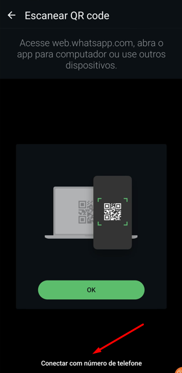
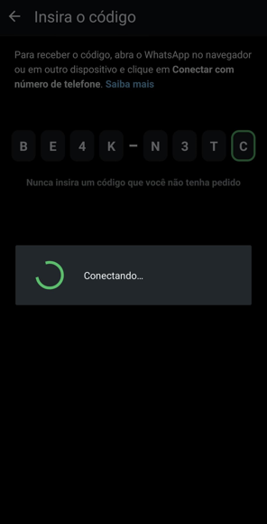
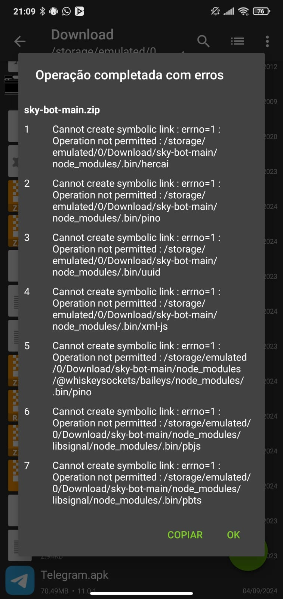

# 🤖 Takeshi Bot

<div align="center">
    
</div>

<br />

<div align="center">
    <a href="https://github.com/guiireal/takeshi-bot">
        
    </a>
</div>

<br />

## Bot WhatsApp multifungsi, dikembangkan dalam video:

[MEMBUAT BOT WHATSAPP DARI NOL (PANDUAN LENGKAP) - BASE KOMPLET + 6 PERINTAH - JAVASCRIPT](https://youtu.be/6zr2NYIYIyc)


## 🌐 Akses Takeshi Bot dalam bahasa lain

<ul style="list-style: none; padding-left: 0;">
  <li>
    
    <strong>Português (BR)</strong> — <a href="https://github.com/guiireal/takeshi-bot">clique aqui</a>
  </li>
  <li>
    
    <strong>English</strong> — <a href="https://github.com/guiireal/takeshi-bot-english">click here</a>
  </li>
  <li>
    
    <strong>Español</strong> — <a href="https://github.com/guiireal/takeshi-bot-espanol">haz clic aquí</a>
  </li>
</ul>

Tentu, aqui está a tradução para o indonésio:

## ❗ PENTING

Proyek ini tidak diperbarui sesering versi Portugis atau Spanyol karena permintaan yang rendah. Jika Anda menemukan masalah, silakan ajukan PR (pull request) atau buka issue!

## 💻 Teknologi yang terlibat

- [Axios](https://axios-http.com/ptbr/docs/intro)
- [Baileys 6.7.18](https://github.com/WhiskeySockets/Baileys)
- [FFMPEG](https://ffmpeg.org/)
- [Node.js >= 22.14.0](https://nodejs.org/en)
- [Spider X API](https://api.spiderx.com.br)

## ⚠ Perhatian

Kami tidak memberikan dukungan gratis jika Anda telah membeli base ini dari pihak ketiga dan membayarnya. Mintalah **orang yang menjual bot kepada Anda untuk memberikan dukungan**. Kami tidak memiliki hubungan dengan pihak ketiga dan tidak bertanggung jawab atas hal tersebut, serta tidak memberikan dukungan dalam kondisi ini.

Jika bot Anda adalah bot resmi Bronxys, berinteraksi dengan kami dan dapatkan dukungan melalui grup:
[https://chat.whatsapp.com/J5OewHvweK1Kf7RGXAwIYM](https://chat.whatsapp.com/J5OewHvweK1Kf7RGXAwIYM)

## Tentang proyek ini

Proyek ini tidak memiliki hubungan resmi dengan WhatsApp. Ini dikembangkan secara independen untuk interaksi otomatis melalui platform.

Kami tidak bertanggung jawab atas penyalahgunaan bot ini. Adalah tanggung jawab pengguna sepenuhnya untuk memastikan bahwa penggunaannya mematuhi ketentuan layanan WhatsApp dan peraturan yang berlaku.

## Instalasi di Termux

1 - Buka Termux dan jalankan perintah berikut.
_Tidak punya Termux? [Klik di sini untuk mengunduh versi terbaru](https://www.mediafire.com/file/wxpygdb9bcb5npb/Termux_0.118.3_Dev_Gui.apk) atau [klik di sini untuk mengunduh versi Play Store](https://play.google.com/store/apps/details?id=com.termux) jika versi MediaFire sebelumnya tidak berfungsi._

```sh
pkg upgrade -y && pkg update -y && pkg install git -y && pkg install nodejs-lts -y && pkg install ffmpeg -y
````

2 - Aktifkan akses ke folder storage di Termux.

```sh
termux-setup-storage
```

3 - Masuk ke folder sdcard.

```sh
cd /sdcard
```

4 - Clone repository.

```sh
git clone https://github.com/guiireal/takeshi-bot-espanol.git
```

5 - Masuk ke folder yang telah di-clone.

```sh
cd takeshi-bot
```

6 - Aktifkan izin baca dan tulis (lakukan langkah ini hanya 1 kali).

```sh
chmod -R 755 ./*
```

7 - Jalankan bot.

```sh
npm start
```

8 - Masukkan nomor telepon dan tekan `enter`.

9 - Masukkan kode yang muncul di Termux ke WhatsApp Anda, [lihat di sini jika tidak menemukan opsi ini](https://youtu.be/6zr2NYIYIyc?t=5395).

10 - Tunggu 10 detik, lalu ketik `CTRL + C` untuk menghentikan bot.

11 - Konfigurasi file `config.js` yang berada di dalam folder `src`.

```js
// Prefix perintah
exports.PREFIX = "/";

// Emoji bot (ubah jika Anda mau).
exports.BOT_EMOJI = "🤖";

// Nama bot (ubah jika Anda mau).
exports.BOT_NAME = "Takeshi Bot";

// Nomor bot. Masukkan nomor bot
// (hanya angka, persis seperti di WhatsApp).
exports.BOT_NUMBER = "558112345678";

// Nomor pemilik bot. Masukkan nomor pemilik bot
// (hanya angka, persis seperti di WhatsApp).
exports.OWNER_NUMBER = "5521950502020";

// LID pemilik bot.
// Untuk mendapatkan LID pemilik bot, gunakan perintah <prefix>get-lid @mention atau +telepon pemilik.
exports.OWNER_LID = "219999999999999@lid";
```

12 - Mulai bot lagi.

```sh
npm start
```

## Instalasi di VPS (Debian/Ubuntu)

1 - Buka terminal baru dan jalankan perintah berikut.

```sh
sudo apt update && sudo apt upgrade && sudo apt-get update && sudo apt-get upgrade && sudo apt install ffmpeg
```

2 - Install `curl` jika belum ada.

```sh
sudo apt install curl
```

3 - Install `git` jika belum ada.

```sh
sudo apt install git
```

4 - Install NVM.

```sh
curl -o- https://raw.githubusercontent.com/nvm-sh/nvm/v0.40.3/install.sh | bash
```

5 - Perbarui source environment Anda.

```sh
source ~/.bashrc
```

6 - Install versi terbaru Node.js versi 22.

```sh
nvm install 22
```

7 - Periksa apakah versi telah terinstall dan aktif.

```sh
node -v # Harus menampilkan versi 22
```

8 - Periksa apakah npm telah terinstall bersama.

```sh
npm -v # Harus menampilkan versi npm
```

9 - Install PM2 (direkomendasikan).

```sh
npm install pm2 -g
```

10 - Clone repository bot di tempat yang Anda inginkan.

```sh
git clone https://github.com/guiireal/takeshi-bot-espanol.git
```

11 - Masuk ke folder yang telah di-clone.

```sh
cd takeshi-bot
```

12 - Ketik perintah berikut.

```sh
npm start
```

13 - Bot akan meminta Anda memasukkan nomor telepon.
Masukkan **persis** seperti di WhatsApp dan hanya angka.


14 - Hubungkan bot ke PM2.

```sh
pm2 start npm --name "takeshi-bot" -- start
```

15 - Bot akan menampilkan **kode pairing** yang harus dimasukkan di `perangkat tertaut` di WhatsApp Anda.


16 - Pergi ke `perangkat tertaut` di WhatsApp Anda.


17 - Klik pada `Tautkan perangkat`.


18 - Di sudut bawah, klik `Tautkan dengan nomor telepon`.



19 - Masukkan **kode pairing** yang Anda terima di terminal, yang dihasilkan di langkah `15`.



20 - Setelah itu, di terminal yang terhenti, seharusnya menampilkan bahwa **berhasil terhubung**.


21 - Ketik `CTRL + C` untuk menghentikan bot.

22 - Sekarang, jalankan dengan `PM2`, jalankan kode berikut.

```sh
pm2 start npm --name "takeshi-bot" -- start
```


23 - Konfigurasi file `config.js` yang berada di dalam folder `src`.

```js
// Prefix perintah
exports.PREFIX = "/";

// Emoji bot (ubah jika Anda mau).
exports.BOT_EMOJI = "🤖";

// Nama bot (ubah jika Anda mau).
exports.BOT_NAME = "Takeshi Bot";

// Nomor bot. Masukkan nomor bot (hanya angka).
exports.BOT_NUMBER = "5511920202020";

// Nomor pemilik bot. Masukkan nomor pemilik bot (hanya angka).
exports.OWNER_NUMBER = "5511999999999";
```

24 - Akhirnya, coba bot!


## Beberapa perintah memerlukan API

Edit file `config.js` yang berada di dalam folder `src` dan tempelkan kunci API Anda dari platform Spider X API, sesuai kode di bawah ini.
Untuk mendapatkan token Anda, akses: [https://api.spiderx.com.br](https://api.spiderx.com.br) dan buat akun Anda secara gratis!

```js
exports.SPIDER_API_TOKEN = "token_anda_di_sini";
```

## Fitur umum

| Fungsi | Konteks | Memerlukan Spider X API?
| ------------ | --- | ---
| Dapatkan ID grup | Pemilik | ❌
| Jalankan perintah infrastruktur | Pemilik | ❌
| Matikan bot di grup | Pemilik | ❌
| Nyalakan bot di grup | Pemilik | ❌
| Ubah gambar bot | Pemilik | ❌
| Aktifkan/nonaktifkan auto-respon | Admin | ❌
| Aktifkan/nonaktifkan keluar grup | Admin | ❌
| Aktifkan/nonaktifkan sambutan | Admin | ❌
| Anti-link | Admin | ❌
| Ban member | Admin | ❌
| Bersihkan chat | Admin | ❌
| Bisu/buka bisu | Admin | ❌
| Buka grup | Admin | ❌
| Hanya untuk admin | Admin | ❌
| Hapus pesan | Admin | ❌
| Jadwalkan pesan | Admin | ❌
| Mention semua | Admin | ❌
| Tutup grup | Admin | ❌
| Ubah nama grup | Admin | ❌
| Ungkap | Admin | ❌
| Blur gambar | Member | ❌
| Buat link | Member | ❌
| Cermin gambar | Member | ❌
| Chat palsu | Member | ❌
| Download video TikTok | Member | ✅
| Gambar AI PixArt | Member | ✅
| Gambar AI Stable Diffusion Turbo | Member | ✅
| Gambar dengan kontras | Member | ❌
| Gambar hitam/putih | Member | ❌
| Gambar pixel | Member | ❌
| Ganti nama stiker | Member | ❌
| Generasi gambar dengan AI | Member | ✅
| Google Gemini | Member | ✅
| Google Search | Member | ✅
| Kanvas balik | Member | ✅
| Kanvas penjara | Member | ✅
| Kanvas RIP | Member | ✅
| Perintah hiburan/game | Member |❌
| Ping | Member | ❌
| Putar audio | Member | ✅
| Putar video | Member | ✅
| Stiker | Member | ❌
| Stiker AI  | Member | ✅
| Stiker ke gambar | Member | ❌
| Stiker teks animasi | Member | ✅
| YT MP3 | Member | ✅
| YT MP4 | Member | ✅
| YT Search | Member | ✅

## Fitur pengiriman (Contoh)

### 🎵 Contoh audio

| Perintah | Fungsi | Deskripsi | Karakteristik |
|---------|---------|-----------|-----------------|
| `/send-audio-from-file` | Kirim audio dari file | Mendemonstrasikan pengiriman file audio dari penyimpanan lokal | Opsi pesan suara, balasan dikutip |
| `/send-audio-from-url` | Kirim audio dari URL | Mendemonstrasikan pengiriman file audio dari URL eksternal | Opsi pesan suara, balasan dikutip |
| `/send-audio-from-buffer` | Kirim audio dari buffer | Mendemonstrasikan pengiriman file audio dari buffer memori | Opsi pesan suara, balasan dikutip, buffer file atau URL |

### 🖼️ Contoh gambar

| Perintah | Fungsi | Deskripsi | Karakteristik |
|---------|---------|-----------|-----------------|
| `/send-image-from-file` | Kirim gambar dari file | Mendemonstrasikan pengiriman file gambar dari penyimpanan lokal | Dukungan untuk caption khusus, mention, balasan dikutip |
| `/send-image-from-url` | Kirim gambar dari URL | Mendemonstrasikan pengiriman file gambar dari URL eksternal | Pengiriman langsung dari URL, dukungan untuk mention, balasan dikutip |
| `/send-image-from-buffer` | Kirim gambar dari buffer | Mendemonstrasikan pengiriman file gambar dari buffer memori | Buffer file atau URL, caption opsional, mention, balasan dikutip |

### 🎬 Contoh video

| Perintah | Fungsi | Deskripsi | Karakteristik |
|---------|---------|-----------|-----------------|
| `/send-video-from-file` | Kirim video dari file | Mendemonstrasikan pengiriman file video dari penyimpanan lokal | Dukungan untuk caption khusus, mention, balasan dikutip |
| `/send-video-from-url` | Kirim video dari URL | Mendemonstrasikan pengiriman file video dari URL eksternal | Pengiriman langsung dari URL, dukungan untuk mention, balasan dikutip |
| `/send-video-from-buffer` | Kirim video dari buffer | Mendemonstrasikan pengiriman file video dari buffer memori | Buffer file atau URL, caption opsional, mention, balasan dikutip |

### 🎞️ Contoh GIF

| Perintah | Fungsi | Deskripsi | Karakteristik |
|---------|---------|-----------|-----------------|
| `/send-gif-from-file` | Kirim GIF dari file | Mendemonstrasikan pengiriman file GIF dari penyimpanan lokal | Dukungan untuk caption, mention, balasan dikutip |
| `/send-gif-from-url` | Kirim GIF dari URL | Mendemonstrasikan pengiriman file GIF dari URL eksternal | Dukungan untuk caption, mention, balasan dikutip |
| `/send-gif-from-buffer` | Kirim GIF dari buffer | Mendemonstrasikan pengiriman file GIF dari buffer memori | Buffer file atau URL, caption, mention, balasan dikutip |

### 🎭 Contoh stiker

| Perintah | Fungsi | Deskripsi | Karakteristik |
|---------|---------|-----------|-----------------|
| `/send-sticker-from-file` | Kirim stiker dari file | Mendemonstrasikan pengiriman file stiker dari penyimpanan lokal | Format WebP |
| `/send-sticker-from-url` | Kirim stiker dari URL | Mendemonstrasikan pengiriman file stiker dari URL eksternal | Format WebP |
| `/send-sticker-from-buffer` | Kirim stiker dari buffer | Mendemonstrasikan pengiriman file stiker dari buffer memori | Buffer file atau URL |

### 📊 Contoh polling/voting

| Perintah | Fungsi | Deskripsi | Karakteristik |
|---------|---------|-----------|-----------------|
| `/send-poll` | Kirim polling | Mendemonstrasikan cara membuat dan mengirim polling/voting di grup | Dukungan untuk pilihan tunggal atau ganda |

### 📄 Contoh dokumen

| Perintah | Fungsi | Deskripsi | Karakteristik |
|---------|---------|-----------|-----------------|
| `/send-document-from-file` | Kirim dokumen dari file | Mendemonstrasikan pengiriman file dokumen dari penyimpanan lokal | Spesifikasi tipe MIME, nama file khusus |
| `/send-document-from-url` | Kirim dokumen dari URL | Mendemonstrasikan pengiriman file dokumen dari URL eksternal | Spesifikasi tipe MIME, nama file khusus |
| `/send-document-from-buffer` | Kirim dokumen dari buffer | Mendemonstrasikan pengiriman file dokumen dari buffer memori | Buffer file atau URL, tipe MIME, nama file khusus |

### 💬 Contoh pesan

| Perintah | Fungsi | Deskripsi | Karakteristik |
|---------|---------|-----------|-----------------|
| `/send-text` | Kirim teks | Mendemonstrasikan pengiriman pesan teks sederhana | Dukungan untuk mention |
| `/send-quoted` | Kirim balasan | Mendemonstrasikan pengiriman pesan balasan | Balasan sukses/error/peringatan |
| `/send-reaction` | Kirim reaksi | Mendemonstrasikan pengiriman emoji reaksi | Berbagai reaksi emoji, reaksi sukses/error/peringatan |

### 📊 Contoh metadata

| Perintah | Fungsi | Deskripsi | Karakteristik |
|---------|---------|-----------|-----------------|
| `/get-message-data` | Dapatkan metadata pesan | Mendemonstrasikan ekstraksi metadata pesan lanjutan atau pesan dikutip | Analisis detail, dukungan untuk balasan pesan, informasi teknis, mention otomatis |
| `/get-group-data` | Dapatkan data grup | Mendemonstrasikan ekstraksi informasi grup | Metadata grup, daftar peserta, informasi admin |
| `/group-functions` | Fungsi grup | Mendemonstrasikan penggunaan fungsi utilitas grup | Ekstraksi nama, pemilik, admin, peserta grup |

### 🎯 Pusat contoh

| Perintah | Fungsi | Deskripsi | Karakteristik |
|---------|---------|-----------|-----------------|
| `/samples-of-messages` | Pusat contoh | Pusat dengan daftar semua contoh yang tersedia | Menu interaktif, akses langsung ke semua contoh |

## Auto-respon

Takeshi Bot memiliki auto-responder bawaan, edit file di `./database/auto-responder.json`:

```json
[
    {
        "match": "Halo",
        "answer": "Halo, apa kabar?"
    },
    {
        "match": "Baik-baik saja",
        "answer": "Saya baik, terima kasih sudah bertanya"
    },
    {
        "match": "Siapa nama kamu?",
        "answer": "Nama saya Takeshi Bot"
    }
]
```

## Di mana menu bot?

Menu bot terletak di folder `src` dalam berkas yang disebut `menu.js`

## Di mana saya dapat mengubah pesan selamat datang dan ketika seseorang meninggalkan grup?

Pesan-pesan tersebut terletak di folder `src` dalam berkas yang disebut `messages.js`

## Implementasi teknis dari contoh

### 📁 Lokasi perintah contoh

Semua perintah contoh berada di: `src/commands/member/samples/`

### 🛠️ Fungsi yang tersedia

Semua perintah contoh menggunakan fungsi dari `src/utils/loadCommonFunctions.js`:

#### Fungsi audio

  - `sendAudioFromFile(filePath, asVoice, quoted)`
  - `sendAudioFromURL(url, asVoice, quoted)`
  - `sendAudioFromBuffer(buffer, asVoice, quoted)`

#### Fungsi gambar

  - `sendImageFromFile(filePath, caption, mentions, quoted)`
  - `sendImageFromURL(url, caption, mentions, quoted)`
  - `sendImageFromBuffer(buffer, caption, mentions, quoted)`

#### Fungsi video

  - `sendVideoFromFile(filePath, caption, mentions, quoted)`
  - `sendVideoFromURL(url, caption, mentions, quoted)`
  - `sendVideoFromBuffer(buffer, caption, mentions, quoted)`

#### Fungsi GIF

  - `sendGifFromFile(file, caption, mentions, quoted)`
  - `sendGifFromURL(url, caption, mentions, quoted)`
  - `sendGifFromBuffer(buffer, caption, mentions, quoted)`

#### Fungsi stiker

  - `sendStickerFromFile(filePath, quoted)`
  - `sendStickerFromURL(url, quoted)`
  - `sendStickerFromBuffer(buffer, quoted)`

#### Fungsi dokumen

  - `sendDocumentFromFile(filePath, mimetype, fileName, quoted)`
  - `sendDocumentFromURL(url, mimetype, fileName, quoted)`
  - `sendDocumentFromBuffer(buffer, mimetype, fileName, quoted)`

#### Fungsi pesan

  - `sendText(text, mentions)`
  - `sendReply(text, mentions)`
  - `sendReact(emoji)`
  - `sendSuccessReply(text, mentions)`, `sendErrorReply(text, mentions)`, `sendWarningReply(text, mentions)`, `sendWaitReply(text, mentions)`
  - `sendSuccessReact()`, `sendErrorReact()`, `sendWarningReact()`, `sendWaitReact()`

#### Fungsi utilitas grup

  - `getGroupMetadata()` - Dapatkan metadata lengkap grup
  - `getGroupName()` - Dapatkan hanya nama grup
  - `getGroupOwner()` - Dapatkan informasi pemilik grup
  - `getGroupParticipants()` - Dapatkan semua peserta grup
  - `getGroupAdmins()` - Dapatkan admin grup

### 🎯 Contoh penggunaan dengan mention

#### Kirim gambar dengan mention

```javascript
await sendImageFromFile("./assets/image.jpg", "Halo @5511999999999!", ["5511999999999@s.whatsapp.net"]);

await sendImageFromURL("https://exemplo.com/imagem.png", 
  "Halo @5511999999999 dan @5511888888888!", 
  ["5511999999999@s.whatsapp.net", "5511888888888@s.whatsapp.net"]
);
```

#### Kirim video dengan mention

```javascript
await sendVideoFromFile("./assets/video.mp4", "Lihat video ini @5511999999999!", ["5511999999999@s.whatsapp.net"]);

const buffer = fs.readFileSync("./video.mp4");
await sendVideoFromBuffer(
  buffer, 
  "Video spesial untuk @5511999999999 dan @5511888888888!", 
  ["5511999999999@s.whatsapp.net", "5511888888888@s.whatsapp.net"]
);
```

#### Kirim GIF dengan mention

```javascript
await sendGifFromFile(
  "./assets/gif.mp4", 
  "Ini untukmu @5511999999999!", 
  ["5511999999999@s.whatsapp.net"]
);
```

### 🎯 Dukungan TypeScript

Definisi TypeScript lengkap tersedia di `src/@types/index.d.ts` dengan:

  - Tanda tangan fungsi detail
  - Deskripsi parameter
  - Contoh penggunaan
  - Spesifikasi tipe return

### 📁 File contoh

Semua file contoh disimpan di `assets/samples/`:

  - `sample-audio.mp3` - File audio untuk tes
  - `sample-document.pdf` - Dokumen PDF untuk tes
  - `sample-document.txt` - Dokumen teks untuk tes
  - `sample-image.jpg` - File gambar untuk tes
  - `sample-sticker.webp` - File stiker untuk tes
  - `sample-video.mp4` - File video untuk tes

## Struktur folder

- 📁 assets ➔ _file multimedia_
    - 📁 auth ➔ _file koneksi bot_
    - 📁 images ➔ _file gambar_
        - 📁 funny ➔ _GIF lucu dari perintah_
    - 📁 samples ➔ _file contoh untuk tes_
    - 📁 temp ➔ _file sementara_
- 📁 database ➔ _file data_
- 📁 node_modules ➔ _modul Node.js_
- 📁 src ➔ _kode sumber bot (biasanya di sini Anda akan paling sering berurusan)_
    - 📁 @types ➔ _folder tempat definisi tipe berada_
    - 📁 commands ➔ _folder tempat perintah berada_
        - 📁 admin ➔ _folder tempat perintah administratif berada_
        - 📁 member ➔ _folder tempat perintah umum berada (semua bisa menggunakan)_
            - 📁 samples ➔ _folder dengan perintah contoh_
        - 📁 owner ➔ _folder tempat perintah pemilik berada (grup dan bot)_
        - 📝🤖-como-criar-comandos.js ➔ _file contoh cara membuat perintah_
    - 📁 errors ➔ _kelas error yang digunakan dalam perintah_
    - 📁 middlewares ➔ _interceptor permintaan_
    - 📁 services ➔ _berbagai layanan_
    - 📁 utils ➔ _utilitas_
    - 📝 config.js ➔ _file konfigurasi robot_
    - 📝 connection.js ➔ _skrip koneksi bot dengan library Baileys_
    - 📝 index.js ➔ _skrip entry point bot_
    - 📝 loader.js ➔ _skrip pemuatan fungsi_
    - 📝 menu.js ➔ _menu robot_
    - 📝 test.js ➔ _skrip tes_
- 📝 ⚡-kasus-kasus-ada-di-sini.js ➔ _easter egg_ 
- 📝 index.js ➔ _skrip entry point bot untuk hosting_
- 📝 .gitignore ➔ _file untuk tidak mengupload folder tertentu ke GitHub_
- 📝 LICENSE ➔ _file lisensi_
- 📝 package-lock.json ➔ _file cache dependensi bot_
- 📝 package.json ➔ _file definisi dependensi bot_
- 📝 README.md ➔ _dokumentasi ini_

## Error umum

### Operasi ditolak saat mengekstrak folder

Error di bawah ini terjadi ketika file ZIP diunduh langsung di handphone dalam beberapa versi apk ZArchiver dan juga di handphone tanpa root.

Untuk menyelesaikannya, ikuti [tutorial instalasi via git clone](https://www.google.com/search?q=%23instalacin-en-termux).



### Penghapusan file sesi dan koneksi ulang

Jika terjadi error dalam koneksi, Anda dapat menghapus file di dalam folder `/assets/auth/baileys`.

```sh
rm -rf ./asset/auth/baileys
```

Kemudian, hapus perangkat dari WhatsApp dengan pergi ke pengaturan WhatsApp di "perangkat tertaut".

Tambahkan perangkat baru lagi.

### Permission denied saat mengakses `cd /sdcard`

<br/>


Buka Termux, ketik `termux-setup-storage` dan kemudian, terima izin.

## Berlangganan channel!

<a href="https://www.youtube.com/@devgui_?sub_confirmation=1" target="_blank" rel="noopener noreferrer"></a>

## Lisensi

[GPL-3.0](https://github.com/guiireal/takeshi-bot-espanol/blob/main/LICENSE)

Proyek ini dilisensikan di bawah Lisensi Publik Umum GNU (GPL-3.0).
Ini berarti bahwa:

  - Anda dapat menggunakan kode ini sesuka Anda, baik untuk proyek pribadi maupun komersial.
  - Anda dapat memodifikasi kode untuk menyesuaikan dengan kebutuhan Anda.
  - Anda dapat membagikan atau menjual kode, bahkan yang telah dimodifikasi, tetapi Anda harus:
        - Mempertahankan kredit kepada penulis asli (Guilherme França - Dev Gui).
        - Membuat kode yang dimodifikasi tersedia di bawah lisensi GPL-3.0 yang sama.

Yang tidak boleh Anda lakukan:

  - Anda tidak dapat mengubah kode ini menjadi sesuatu yang proprietary (tertutup) dan mencegah orang lain mengaksesnya atau menggunakannya.

Lisensi ini menjamin bahwa semua orang memiliki akses ke kode sumber dan dapat berkolaborasi secara bebas, mempromosikan pertukaran dan peningkatan proyek.

## ⚠ Penafian

Dalam proyek ini, saya harus meng-host `node_modules` untuk membantu mereka yang menjalankan bot dari handphone, karena banyak dari mereka mungkin tidak dapat menjalankan `npm install` dengan benar melalui Termux.